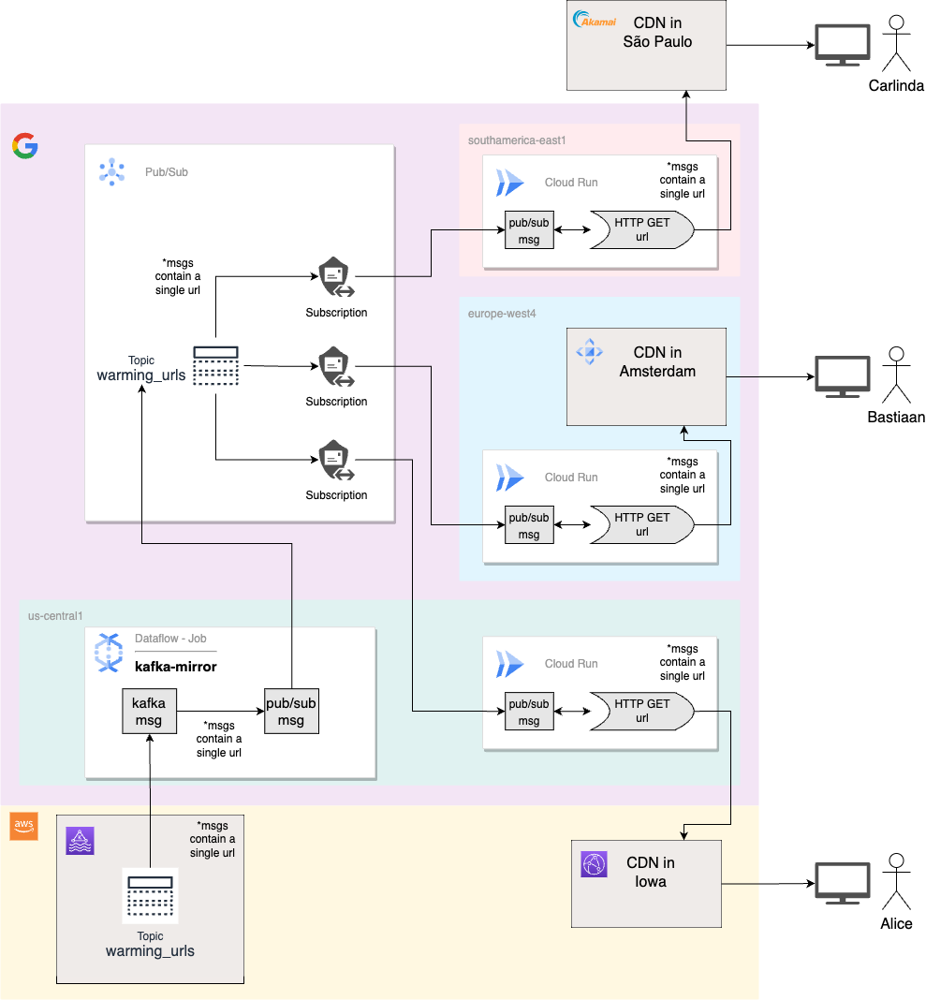

# Distributed Generic CDN Warming PoC

## Introduction
This project showcases taking messages containing a URL from a Kafka topic, translating them into Pub/Sub messages and then using push subscriptions to invoke Cloud Run instances across any number of regions to process the messages, take the URL and make a GET call to the url, thus hitting the local CDN and having it cache that URL from the origin.

## Goals
1. We show that Pub/Sub push will scale Cloud Run instances to deal with all the messages coming through
1. We show how a Dataflow job can be used to get messages from Kafka and send them to Pub/Sub

## Architecture
This is a high-level architecture of an installation of a Regional CDN Warming system using Kafka, Dataflow, Pub/Sub and Cloud Run



## Setup & Installation
> **NOTE:** We're assuming that your environment will be the Google Cloud Shell which already has the necessary tooling. If you're using your own machine, you'll have some installs to do

### Setting up Kafka
For ease of use, get a free trial instance of Kafka from Confluent. You will need to fill in the information for instance and username/password in the `kafka-env` file.

In your Kafka environment set up a topic, eg: `warming_urls`.  You'll need this value later.

### Setting up your Python environment
We'll be using a virtual environment to keep things neat and tidy for our Python code.

1. Navigate to the root of this repository
    ```
    cd ./cdn-warming-poc
    ```

1. Create the virtual python environment

    ```
    python -m venv .venv
    source ./.venv/bin/activate
    ```
    > **NOTE:** You need to activate every time you do not see "`(.venv)`" in your command prompt using this command:
    ```
    source ./.venv/bin/activate 
    ```

1. Install required Python libraries

    ```
    pip install -r ./requirements.txt
    ```

### Setting up Artifact Registry
You will need to set up an Artifact registry for Docker that will hold the container image for our python code.

In the Google Cloud Console, go to **Artifact Registry** and click the **+** button to create a new registry

Select type **Docker**, give it a name and pick a region (eg: `us-east4`) and click the **Create** button.

Now click into the new registry from the list of registries and you will see the path of this new registry at the top. Click the **Copy** button and you will have a value like this in your clipboard:

> `us-east4-docker.pkg.dev/my-project/registry-docker`

### Setting up Cloud Build
Next we'll set up a Cloud Build that will build from this repository's code, create Docker container image and upload it to Artifact Registry.

> **NOTE:** You will need to make your own fork of this Github repository so that you can change `cloudbuild.yaml`. Edit the `cloudbuild.yaml` file at the root of this project and change the paths to match your Artifact Registry path above. (**NOTE:** You can use the `$PROJECT_ID` variable in your URL, eg: `us-east4-docker.pkg.dev/$PROJECT_ID/registry-docker/cdn-prewarm-pubsub:latest`).

Go to **Cloud Build** and click on **Repositories** on the left hand side. Click the **2ND GEN** tab at the top.

Click **Create Host Connection** in the middle of the screen. On the next page select **GitHub** on the left side and then pick a **Region** (eg: `us-east4`) and give it a name (eg: `github-us-east4`) then click the **Connect** button at the bottom.

Back at the **Repositories / 2ND GEN** screen, click **Link Repository** in the middle of the screen. Select the connection you just created and pick the **{your github username}/cdn-warming-poc** repository, click the **Link** button to create the link.

Now click on **Triggers** on the left hand side and click the **Create a Trigger** button in the middle of the screen. Give it a **Name** and **Region** (eg: `us-west4`, must match the Repository Link we just created).

Pick your **Event**, you can choose *Push to a branch* or *Manual invocation* or whatever you want.

For **Source** pick **2nd gen**, then pick the **Repository** we just created. (If you're triggering based on Push to Branch, it will default to using the *main* branch).

Leave the rest of the defaults and click the **Create** button to make this Cloud Build trigger.

### Setting up Pub/Sub
You will need to create the Pub/Sub topic, as well as a Service Account to invoke Cloud Run from Pub/Sub message pushes. 

Run the following command with whatever substitutions you want:

```bash
./scripts/pubsub-setup.sh { topic_name } 
```
- `topic_name`: The name of a new Pub/Sub topic, eg: `warming_urls`

### Starting the Dataflow Pipeline
We need a Dataflow pipeline that will poll Kafka and if messages are found it will recreate those messages on the Pub/Sub topic.

We have a python script that will create this pipeline and start it running. It will run until you manually stop it in the console.

> **Note** The script will run and then block. This is expected. You can hit Ctrl-C and the job will continue to run and be visible in the console. 

```bash
python -m cdn_prewarm.kafka-pubsub-dataflow-job { config_file } { kafka_topic } { pubsub_topic } { project_id } { region }
```
- `config_file`: The name of the file containing your Kafka credentials, eg: `kafka-env`
- `kafka_topic`: The name of the Kafka topic to watch, eg: `warming_urls`
- `pubsub_topic`: The full path of the Pub/Sub topic to watch, eg: `projects/cdn-warming-poc/topics/warming_urls`
- `project_id`: The name of your Google Cloud project, eg: `cdn-warming-poc`
- `region`: The region you want to create the Pipeline in, eg: `us-central1`

Once this script runs and returns, you can see the new pipeline in the console by going to **Dataflow** and looking at the **Jobs** screen. 

> **Note** You should stop jobs when you're not actively working. To start a new job, run the script again. Stopped jobs can not be restarted.

### Creating Cloud Run Instances and Pub/Sub Subscriptions
The next two steps you will need to repeat for every region you want Cloud Run instances to run.

#### Create Cloud Run Instances
To create the Cloud Run instance, we have a shell script to help you, run it like so:

```bash
create-cloudrun.sh {cloudrun_service_name} {region} {full_image_path}
```
- `cloudrun_service_name`: The name of the new Cloud Run service, eg: `cdn-prewarm-us-east4` 
- `region`: The region this Cloud Run service will be based in, eg: `us-east4`
- `full_image_path`: The full path to the Docker image used for this Cloud Run service, eg: `us-east4-docker.pkg.dev/my_project/registry-docker/cdn-prewarm-pubsub`

This script runs some `gcloud` commands and when finished will output the new Cloud Run service's endpoint URL, eg: `https://cdn-prewarm-us-east4-7xxxk6gxsq-uc.a.run.app`

#### Create Pub/Sub Push Subscriptions
Next we will create a Pub/Sub push subscription to our `warming_urls` topic and use the endpoint URL of the new Cloud Run service to receive the push notifications of new messages.

Run the shell script like so:

```bash
pubsub-create-sub.sh {cloudrun_endpoint_url} {new_sub_name} {topic_name}
```
- `cloudrun_endpoint_url`: The endpoint of the new Cloud Run service generated above, eg: `https://cdn-prewarm-us-east4-7xxxk6gxsq-uc.a.run.app`
- `new_sub_name`: The name of this subscription, eg: `us-east4-sub`
- `topic_name`: The name of the Pub/Sub topic created above, eg: `warming_urls`

## Running The Demo
Now we're ready to run the demo, we will produce Kafka messages which trigger the following high-level flow:

1. A Kafka message containing the URL to GET sent to the Kafka topic.
1. A Dataflow pipeline will poll the Kafka topic and if a message is found, it will create a Pub/Sub message containing the same URL and add it to the Pub/Sub topic.
1. All subscriptions listening to the Pub/Sub topic will trigger and create a new Cloud Run instance to process the message.
1. The Cloud Run python code will read the message, extract the URL and make a GET call to it.
1. Cloud Run will scale up to handle all the messages coming in as needed. 

The above is achieved using these files in this repository: 

1. N number of Kafka messages containing random URLs are created with `producer.py`
1. The Dataflow pipeline implementation is in `kafka-pubsub-dataflow-job`
    - It should already be running if you followed the instructions above.
1. Cloud Run instances execute the python code in `consumer-pubsub.py`

> **NOTE**: The `consumer-kafka.py` is just a helper program that can be used to consume messages directly from the Kafka topic and make the GET calls to the URLs. This is included for testing purposes only.

## Contributors
- Gino Filicetti